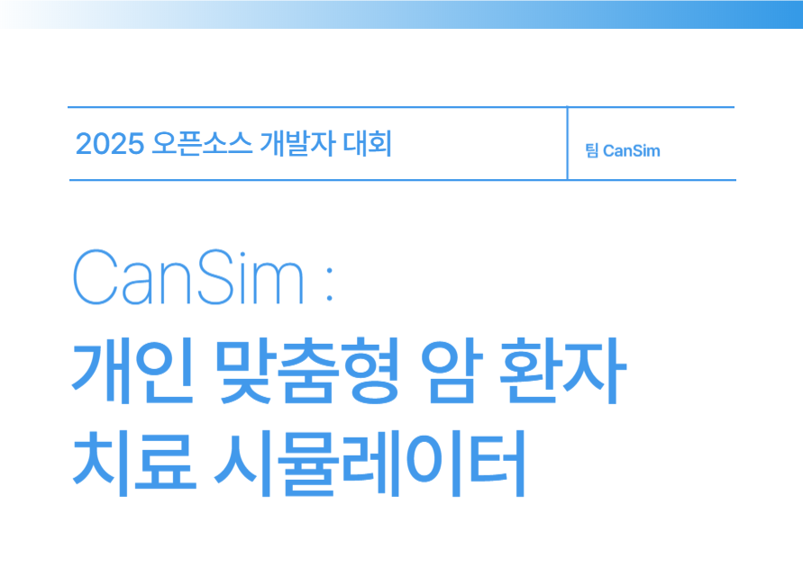

# CanSim : 개인 맞춤형 암 환자 치료 시뮬레이터



---

## 📌 개요
**CanSim**은 환자의 의료 데이터를 기반으로 **개인 맞춤형 암 치료 전략을 시뮬레이션**하는 AI 기반 시스템입니다.  
CT/MRI 영상 및 바이탈 데이터를 입력받아, 다양한 약제 반응을 예측하고 12주 시각화를 통해 치료 플랜을 제안합니다.  

- 개발 목적: 환자와 가족의 육체적·정신적 부담 완화 및 의료진의 정밀 의사결정 지원  
- 주요 기능: 환자 데이터 입력 → 모델 시뮬레이션 → 치료 플랜 시각화 → 보고서 저장  

---

## 🧠 모델 설명

### <CanSim_model>
해당 모델은 **이미지 데이터와 Tabular Data**를 함께 입력받아 약물의 반응을 예측하는 구조입니다.  
- 이미지 처리: 사전 학습된 **ResNet18**을 활용, 마지막 Fully Connected Layer는 제거하고 **backbone(특징 추출기)** 으로만 사용  
- Tabular Data: 별도의 **Linear Layer**로 벡터 변환  
- 결합 방식: **Late Fusion**을 적용하여 두 feature를 합친 뒤, Fully Connected Layer를 거쳐 각 약물별 치료 효과(Logits)를 출력  

### <model_train>
모델 학습은 **100 Epoch** 동안 진행되었습니다.  
- 평균 Validation Loss: **1.3865**  
- 평균 Accuracy: **0.2483**  
- 평균 F1-Score: **0.1755**  

초기에는 지표가 낮았으나, 학습이 진행되며 **안정적으로 수렴**하는 모습을 보였습니다.  
특히 F1-Score는 **0.1 수준 → 최종 0.205**까지 개선되었고, Class 불균형이 있음에도 일정 수준의 예측 성능을 달성했습니다.  

### <create_report>
학습된 모델은 실제 환자의 **CT/MRI Image + Tabular Data**를 입력받아,  
- **12주 기준 병변 추이 예측**  
- **약물별 치료 효과 계산**  
- **가장 효과적인 약물 추천**  
- 최종적으로 **PDF Report 생성**  

까지 수행합니다. 

---

## 📂 프로젝트 구조

```plaintext
📂 CanSim
├── backend/ # FastAPI 기반 백엔드
│ ├── main.py # API 및 모델 추론 로직
│ ├── model_def.py # CanSim 모델 정의 (PyTorch)
│ ├── cancer_drug_effect.csv # 암 종류 ↔ 약제 매핑 데이터
│ │
│ ├── data/
│ │ └── base_images/ # 암 종류별 CT/MRI 예시 이미지
│ │
│ ├── models/
│ │ └── best_model.pth # 학습 완료된 모델 가중치
│ │
│ ├── utils/ # 시뮬레이션 보조 유틸 모듈
│ │ ├── simulate_all_drugs_fast.py # 약제별 시뮬레이션 실행
│ │ └── get_simulation_data.py # 결과 데이터/이미지 정리
│ │
│ ├── results/ # 저장된 결과(JSON)
│ └── temp_images/ # 시뮬레이션 중 생성되는 임시 이미지
│
├── frontend/ # React (Vite) 기반 프론트엔드
│ ├── Home.jsx # 메인 화면
│ ├── PatientInput.jsx # 환자 데이터 입력
│ ├── VirtualPatient.jsx # 입력 정보 확인
│ ├── Simulation.jsx # 약제별 시뮬레이션 결과 시각화
│ └── Summary.jsx # 최종 보고서 요약 및 저장
│
├── CanSimModel_reference/ # 모델(실행과 무관)
│ ├── CanSim_Class.ipynb # 모델 클래스 정의 설명
│ ├── CanSim_full.ipynb # 전체 학습/추론 예시 코드
│ └── README.md # 참고 안내 문서
│
└── README.md # 프로젝트 설명 문서 (본 파일)
```
---

## 🚀 실행 방법

### 1) 백엔드 실행 (FastAPI)
```bash
cd backend
uvicorn main:app --reload --port 8000
```
API 서버: http://127.0.0.1:8000
⚠️ 필요 시 가상환경을 생성해서 실행하세요:
```bash
cd backend
python -m venv .venv
.venv\Scripts\activate    # (Windows)
```

### 2) 프론트엔드 실행 (React / Vite)
```bash
cd frontend
npm install
npm run dev
```
프론트엔드: http://localhost:5173

---
## 🔧 utils 폴더
simulate_all_drugs_fast.py : 모델을 이용해 모든 약제별 시뮬레이션 실행
get_simulation_data.py : 시뮬레이션 결과를 주차별 이미지/점수 데이터로 정리

---
## 🛠 기술 스택
- Backend: FastAPI, PyTorch, Pandas, Pillow
- Frontend: React (Vite), JavaScript
- Model: ResNet18 (이미지), Linear Network (Tabular), Late Fusion

---
## 🔮 향후 발전 방향
- 더 많은 암 종류와 약제 데이터셋 확장
- 모델 성능 개선 (Class imbalance 보정, Multi-modal 학습 고도화)
- PDF 리포트 자동 생성 기능 강화
- 인터페이스 개선

---
## 🎥 시연 영상
[](https://youtu.be/AZa5saE7sR8)


